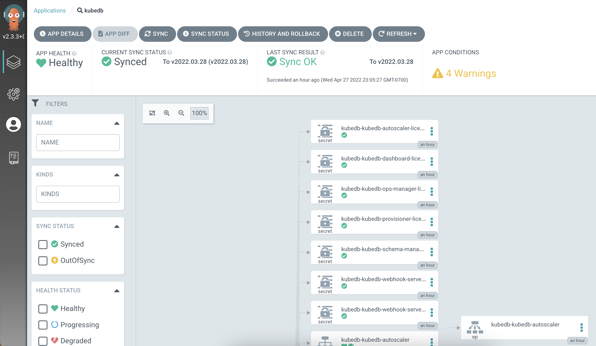

# Deploy KubeDB operator using ArgoCD

- Deploy KubeDB Helm chart. Update the Application CRD to include License key.

```
> k create ns kubedb
> k apply -f argocd-app.yaml
> argocd app sync kubedb
```

- After the chart is deployed, you might see `OutOfSync` status because the `{Mutating|Validating}WebhookConfiguration` cabundle has been updated by the operator itself. To address this, we need to update the `argocd-cm` configmap and add the following keys:

```
k edit cm argocd-cm -n argocd
```

```
data:
  resource.customizations.ignoreDifferences.admissionregistration.k8s.io_MutatingWebhookConfiguration: |
    jqPathExpressions:
    - '.webhooks[]?.clientConfig.caBundle'
  resource.customizations.ignoreDifferences.admissionregistration.k8s.io_ValidatingWebhookConfiguration: |
    jqPathExpressions:
    - '.webhooks[]?.clientConfig.caBundle'
```

You can learn more on this from the official ArgoCD docs:

- https://argo-cd.readthedocs.io/en/stable/user-guide/diffing/#system-level-configuration
- https://github.com/argoproj/argo-cd/blob/master/docs/operator-manual/argocd-cm.yaml#L82-L91

- After that the application should be in `Synced` status. You will see some warning but you can ignore those. KubeDB uses a parent/child chart structure and some YAMLs have been included in multiple child charts incase they were installed separately. ArgoCD gives a warning for that.




